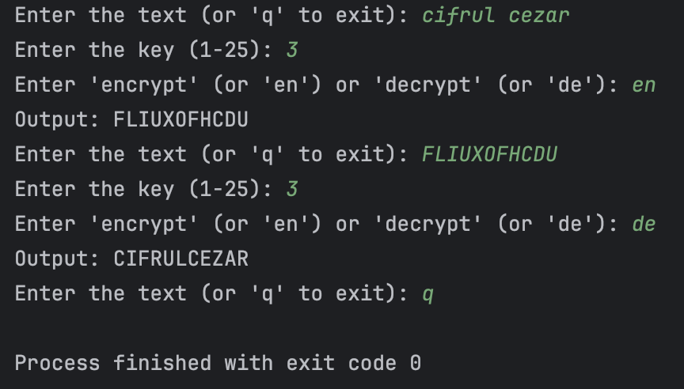

# Laboratory Work No.1 Caesar's cipher

### Course: Cryptography & Security
### Author: Chichioi Iuliana, FAF-221

----


### Overview of Cryptography
Cryptography is a branch of science under the broader discipline of cryptology. It involves the study of techniques for secure communication in the presence of adversaries. The two main components are:

- **Cryptography**: The practice and study of techniques for securing communication and information.
- **Cryptanalysis**: The art of breaking cryptographic codes and ciphers.

### Caesar Cipher
The Caesar cipher is a classical encryption technique that employs a simple substitution method. Each letter in the plaintext is replaced by a letter some fixed number of positions down or up the alphabet. The key \( k \) is the number of positions shifted, and it remains the same for both encryption and decryption.

### Mathematical Representation
The encryption and decryption functions are mathematically expressed as:

- **Encryption**: 
  \[
  c = e_k(x) = (x + k) \mod n
  \]
- **Decryption**:
  \[
  m = d_k(y) = (y - k) \mod n
  \]

Where:
- \( c \): encrypted message
- \( m \): decrypted message (original text)
- \( x \) and \( y \): numeric representation of the respective characters
- \( k \): key
- \( n \): size of the alphabet

### Weakness of the Caesar Cipher
Due to the limited number of possible keys (25 for the Latin alphabet), the Caesar cipher is vulnerable to brute force attacks. An attacker can try all possible keys until the original plaintext is recovered.

---

## Objectives

1. **Implement the Caesar cipher** algorithm for the English alphabet.
2. **Restrict key values** between 1 and 25.
3. **Process valid input** characters and ignore others.
4. **Convert input text** to uppercase and remove spaces.
5. **Allow user selection** for encryption or decryption.
6. **Develop a two-key Caesar cipher**, ensuring the second key is at least 7 letters long.

---

## Implementation description

### Task 1.1. Basic Caesar Cipher

### Code Implementation Steps

1. **Function Definition:**
The function `caesar_cipher` takes three parameters:

- **text**: The input string to be encrypted or decrypted.
- **key**: An integer representing the number of positions to shift in the alphabet (between 1 and 25).
- **mode**: A string indicating whether to encrypt or decrypt the text (default is 'encrypt').

   ```python
   def caesar_cipher(text, key, mode='encrypt'):
       alphabet = "ABCDEFGHIJKLMNOPQRSTUVWXYZ"
       result = ""

2. **Text Preparation:** The input text is converted to uppercase, and spaces are removed to standardize the input.

  ```python
text = text.upper().replace(" ", "").strip()
   ```
3.**Character Processing:** The function iterates through each character in the text. If the character is valid, it calculates the new index based on the mode (encryption or decryption) and updates the result.

```python
for char in text:
    if char in alphabet:  # Only process valid characters
        idx = alphabet.index(char)  # Find the index of the character
        if mode == 'encrypt':
            new_idx = (idx + key) % 26  # Encryption formula
        else:
            new_idx = (idx - key) % 26  # Decryption formula
        result += alphabet[new_idx]  # Append the new character to the result
```

4.**User Input Loop:** Handles user input for text, key, and mode.

```python
if __name__ == "__main__":
    while True:
        text = input("Enter the text (or 'q' to exit): ")
        if text.lower() == 'q':
            break  # Exit condition
```
5.**Key and Mode Validation:** Ensures the key is between 1-25 and allows mode selection.

```python
key = int(input("Enter the key (1-25): "))  # Input key
mode_input = input("Enter 'encrypt' or 'decrypt': ").strip().lower()  # Input mode
```

6.**Key and Mode Validation:** Prints the final encrypted or decrypted output.

```python
output = caesar_cipher(text, key, mode)  # Call function
print(f"Output: {output}")  # Display output
```

### Task 1.2. Basic Caesar Cipher

### Code Implementation Steps

1. **Function Definition:** The function `generate_permuted_alphabet` creates a permuted alphabet based on a given keyword. It takes one parameter:

- **keyword**: A string used to generate a unique alphabet by removing duplicates and appending the remaining letters of the standard alphabet.

```python
def generate_permuted_alphabet(keyword):
    keyword = keyword.upper()
    alphabet = "ABCDEFGHIJKLMNOPQRSTUVWXYZ"
```

2. **Permuted Alphabet Generation:** The function creates a set of unique characters from the keyword, ensuring that all characters are valid. It then constructs the permuted alphabet by appending any remaining letters from the standard alphabet.

```python
unique_chars = []
for char in keyword:
    if char not in unique_chars and char in alphabet:
        unique_chars.append(char)

for char in alphabet:
    if char not in unique_chars:
        unique_chars.append(char)

return ''.join(unique_chars)
```

3.**Caesar Cipher with Two Keys:** The function `caesar_cipher_with_two_keys` uses the generated permuted alphabet to encrypt or decrypt the input text. It takes four parameters:

- **text**: The input string to be encrypted or decrypted.
- **key1**: An integer representing the number of positions to shift in the permuted alphabet.
- **key2**: A string used to generate the permuted alphabet.
- **mode**: A string indicating whether to encrypt or decrypt the text (default is 'encrypt').

```python
def caesar_cipher_with_two_keys(text, key1, key2, mode='encrypt'):
    permuted_alphabet = generate_permuted_alphabet(key2)
    result = ""
    text = text.upper().replace(" ", "").strip()  # Normalize input text
```

4.**Text Preparation:** The input text is converted to uppercase, and spaces are removed to standardize the input for processing.

```python
text = text.upper().replace(" ", "").strip()  # Normalize input text
```
5.**Character Processing:** The function iterates through each character in the normalized text. If the character is valid, it calculates the new index based on the mode (encryption or decryption) and updates the result accordingly.

```python
for char in text:
    if char in permuted_alphabet:  # Only process valid characters
        idx = permuted_alphabet.index(char)
        if mode == 'encrypt':
            new_idx = (idx + key1) % 26  # Encryption formula
        else:
            new_idx = (idx - key1) % 26  # Decryption formula
        result += permuted_alphabet[new_idx]
    else:
        result += char  # Keep non-alphabet characters unchanged

```

6.**User Input Loop:** Handles user input for text, two keys, and the mode (encrypt or decrypt).
```python
if __name__ == "__main__":
    while True:
        text = input("Enter the text (or 'q' to exit): ")
        if text.lower() == 'q':
            break

```
7.**Key and Mode Validation:** Ensures the first key is between 1-25, prompts for a keyword of at least 7 letters for the second key, and allows mode selection.

```python
while True:
    key1 = int(input("Enter the key (1-25): "))  # Input key
    # Validate key1
    # Input key2 (keyword) and validate
    # Input mode and validate
```

8.**Output:** Prints the final encrypted or decrypted output based on the user’s inputs.

```python
output = caesar_cipher_with_two_keys(text, key1, key2, mode)  # Call function
print(f"Output: {output}")  # Display output
```
--- 
## Conclusions

In this laboratory work, I implemented the Caesar cipher and its two-key variant, enhancing the understanding of cryptographic techniques. The basic Caesar cipher provided insights into character substitution and the importance of key validation, while the two-key implementation introduced a permuted alphabet, increasing encryption complexity. Overall, this work highlighted the strengths and vulnerabilities of classical ciphers in secure communication.

## Results

The implementation of the Caesar cipher and its two-key variant yielded successful results in the following areas:

1. **Basic Encryption and Decryption**: The program correctly encrypts and decrypts messages using the specified key, demonstrating accurate character shifting.
2. **Key Validation**: The input validation for keys ensures that users only provide values between 1 and 25, preventing errors during execution.
3. **Permuted Alphabet Generation**: The two-key variant effectively generates a unique permuted alphabet based on the provided keyword, enhancing security by reducing predictability.
4. **User Interaction**: The program offers a smooth user experience, allowing for repeated inputs and clear outputs.

### Screenshots

Below are screenshots illustrating the functionality of the implemented Caesar cipher for each task:




*Screenshot 1: Task 1.1. - Demonstrating the basic Caesar cipher encryption and decryption process.*


*Screenshot 2: Task 1.2 - Demonstrating the two-key Caesar cipher with permuted alphabet generation.*
